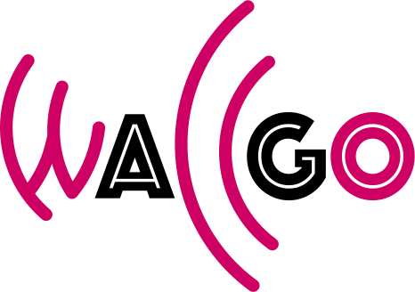

# WallGo Project

**WallGo** is an open source code for the computation of the bubble wall velocity and bubble wall width in first-order cosmological phase transitions.

The WallGo Project consists of one main Python package and two helper packages.
- [**WallGo**](https://github.com/Wall-Go/WallGo) is the main Python package which determines the wall velocity and width by solving the scalar field(s) equation of motion, the Boltzmann equations and energy-momentum conservation for the fluid velocity and temperature.
- [**WallGoCollision**](https://github.com/Wall-Go/WallGoCollision) performs the higher-dimensional integrals to obtain the collision terms in the Boltzmann equations, and is written in C++. It also has Python bindings so that it can be called directly from Python, but still benefits from the speedup from compiled C++ code.
- [**WallGoMatrix**](https://github.com/Wall-Go/WallGoMatrix) computes the relevant matrix elements for the out-of-equilibrium particles, and is written in Mathematica. It builds on existing Mathematica packages [DRalgo](https://github.com/DR-algo/DRalgo) and [GroupMath](https://renatofonseca.net/groupmath).

